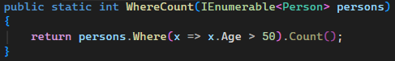
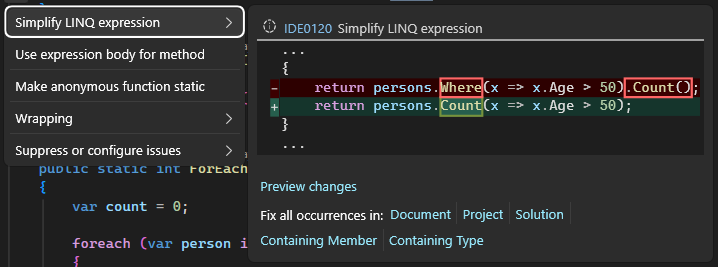
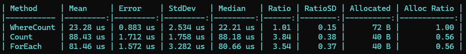
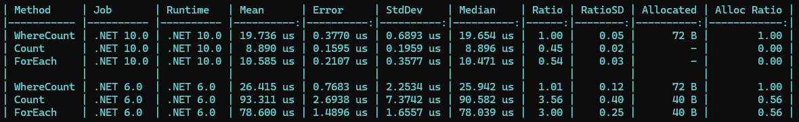
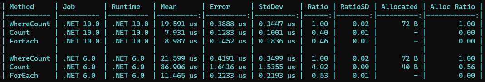
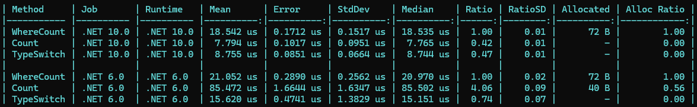

# Unit Price Example

You get a Story assigned to implement variable pricing for a product depending on the quantity ordered.

Example:
- > 1.000 units: 0.50€ per unit
- > 10.000 units: 0.40€ per unit
- > 100.000 units: 0.30€ per unit
- ...

## Linq

```cs
record PriceTier(int MinQuantity, decimal UnitPrice);

public decimal GetUnitPrice(int quantity, List<PriceTier> tiers)
{
    return tiers
        .Where(t => quantity >= t.MinQuantity)
        .MaxBy(t => t.MinQuantity)!
        .UnitPrice;
}
```

## PriceTable with BinarySearch

```cs
public class PriceTable
{
    private readonly int[] _minQuantities;
    private readonly decimal[] _unitPrices;

    public PriceTable(List<PriceTier> tiers)
    {
        var sorted = tiers.OrderBy(t => t.MinQuantity).ToList();
        _minQuantities = sorted.Select(t => t.MinQuantity).ToArray();
        _unitPrices = sorted.Select(t => t.UnitPrice).ToArray();
    }

    public decimal GetUnitPrice(int quantity)
    {
        var index = Array.BinarySearch(_minQuantities, quantity);

        if (index < 0)
        {
            index = ~index - 1;
        }

        return _unitPrices[index];
    }
}
```

## Runtime changes

Got the Code down from O(n) to O(log n) but the code is more complex now.

PO comes to you and tells you that this is only gonna be used with 3 tiers and only for special, high volume customers.
--> No real need to optimize this, the Linq version is good enough and easier to read

Also we now introduced a possible failure for other developers and they might directly use `new PriceTable(tiers).GetUnitPrice(quantity)` removing all the optimizations we did.

# When to optimize

"Premature Optimization is the root of all evil" - Donald Knuth

## No premature optimizations

Optimizing before we know that we actually need to (and potentially spending a lot of time on it)

Code itself may be harder to understand

# C# vs Linq

```cs
record Person(string Name, string Gender, int Age);

public int CountPersonsOver50(IEnumerable<Person> persons)
{
    return persons.Where(x => x.Age > 50).Count();
}
```

## How could we optimize this?

### Visual Studio already shows us:





```cs
public int CountPersonsOver50(IEnumerable<Person> persons)
{
    return persons.Count(x => x.Age > 50);
}
```

```cs
public int CountPersonsOver50(IEnumerable<Person> persons)
{
    var count = 0;

    foreach (var person in persons)
    {
        if (person.Age > 50)
        {
            count++;
        }
    }

    return count;
}
```

## So now the Code is faster no?

Answer: Probably, but we don't know

# BenchmarkDotNet

Short description of workings

## WhereCountVsCountVsForEach

```cs
[MemoryDiagnoser]
[SimpleJob(RuntimeMoniker.Net60)]
public class CountPersonsOver50Benchmark
{
    private IEnumerable<Person> _persons = null!;

    [GlobalSetup]
    public void Setup()
    {
        _persons = PersonFaker.Generate(10_000);
    }

    [Benchmark(Baseline = true)]
    public int WhereCount() => CountPersonsOver50.WhereCount(_persons);

    [Benchmark]
    public int Count() => CountPersonsOver50.Count(_persons);

    [Benchmark]
    public int ForEach() => CountPersonsOver50.ForEach(_persons);
}
```

## Result



Explanation how to read the result.

Ok, so now we have actually proofed that our optimization works (cut off, act confused).
... But wait, WhereCount was actually faster?

## Result - Huh?

Huh, why did that happen?

## Result - Trick

1. Used .net6.0, newer versions of .net highly optimized Linq using Spans in the background
2. Used IEnumerable which is a generic type and has to be handled in a generic way, so the compiler can't optimize it as good as it could with a List or an Array (only works like this in older .net versions)

## Result with .net10.0



## Result with List



# Optimization is Hard

You have to measure it, relying on intuition is not enough.

# First Problem vs Fable

Fable 5.1 High - 15.09.2026
Prompt:
In .net6.0, how could we optimize this (do not change the signature of the function)?
Also guess the speedup.

```markdown
record Person(string Name, string Gender, int Age);

public int CountPersonsOver50(IEnumerable<Person> persons)
{
    return persons.Where(x => x.Age > 50).Count();
}
```

## Result (Summarized)

Use Count directly (~1.2x - 1.5x)
Check if IEnumerabel is a List or an Array and then loop over it knowing that it is a List / an Array

## Results (Benchmark)



Solution with TypeSwitch is not bad in .net6.0.
Sadly the model outputs the same optimization suggestion for .net10.0 where Count and TypeSwitch has about the same performance with TypeSwitch being more complex than a simple Linq.
